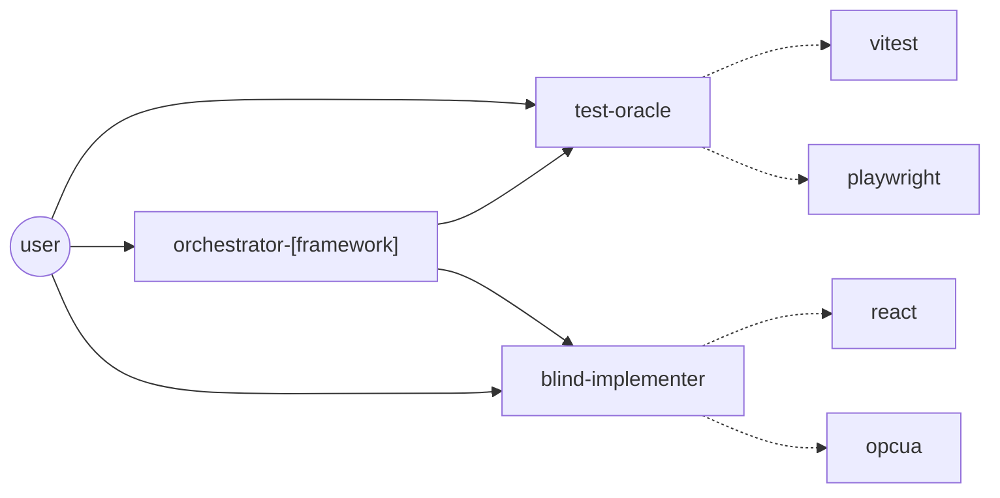

# Agents Overview

This document describes the custom agents defined in this repository, how they can be invoked, and how they delegate to one another.

## Invocation model

- Only `orchestrator-[framework]` (e.g. `orchestrator-react`, `orchestrator-fastapi`), `test-oracle`, and `blind-implementer` are `user-invocable: true` — these are the only agents selectable directly from the chat agent picker.
- `react`, `playwright`, `vitest`, and `opcua Agent` are `user-invocable: false` — they are reachable only through delegation from another agent, never directly by the user.
- An agent can only delegate to sub-agents listed in its own frontmatter `agents: [...]` array, and only when its `tools` list includes `agent`.
- **Required** delegation is enforced by the agent's own instructions (an explicit workflow step) — the model is expected to follow it on every run.
- **Optional** delegation is guidance only — the model decides at runtime whether the task warrants calling that sub-agent.

## Graph

Solid arrows = user-invocable entry points / required delegation. Dashed arrows = optional, model-judgment delegation into non-user-invocable specialist agents.

## Agents table

| Agent | Directly invocable | Can delegate to | Delegation type | Role |
|---|---|---|---|---|
| `orchestrator-[framework]` | Yes | `test-oracle`, `blind-implementer` | Required | Orchestrates full requirements → tests → implementation → verification delivery for a given framework. Currently `orchestrator-react` (React feature delivery, following the target project's own folder conventions) or `orchestrator-fastapi` (FastAPI code review/hot fixes). |
| `test-oracle` | Yes | `playwright`, `vitest` | Optional | Defines acceptance/edge-case tests from requirements as an independent quality gate; delegates authoring by test type. |
| `blind-implementer` | Yes | `react`, `opcua Agent` | Optional | Implements from requirements only, without reading test files; delegates for architecture or OPCUA integration help. |
| `react` | No (delegation only) | — | — | React architecture, component/state design, scalable refactors. |
| `playwright` | No (delegation only) | — | — | Bootstraps/maintains end-to-end (Playwright) tests. |
| `vitest` | No (delegation only) | — | — | Bootstraps/maintains unit/component (Vitest) tests. |
| `opcua Agent` | No (delegation only) | — | — | OPCUA direct-method integration (e.g., CheckDataPoints node-status) between app-wizard and seal-module-opcua-client. |

## Recommended flow for new features

1. Invoke `orchestrator-[framework]` (e.g. `orchestrator-react`, `orchestrator-fastapi`) directly with the request.
2. `orchestrator-[framework]` restates the requirements and invokes `test-oracle`, which writes acceptance tests (delegating to `vitest` and/or `playwright` as needed).
3. `orchestrator-[framework]` hands the requirement summary + checklist to `blind-implementer`, which implements the change (delegating to `react` for architecture decisions or `opcua Agent` for OPCUA integration when relevant).
4. `orchestrator-[framework]` re-runs the tests created by `test-oracle` as the final gate and reports the result.
